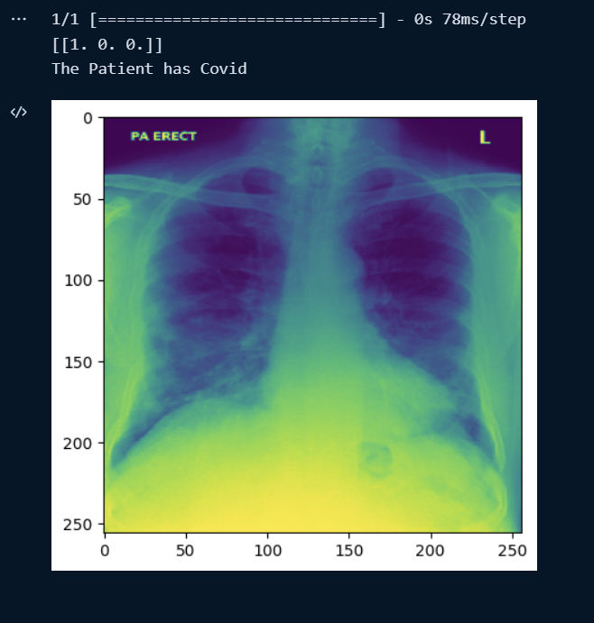

# Covid-19 Pneumonia Model
## Multi Classification Covid and Pneumonia Model with TensorFlow and CNN
- It was trained using the following Kaggle [dataset](https://www.kaggle.com/datasets/pranavraikokte/covid19-image-dataset)
- The model has 80% accuracy
## This Model was Builded using the Following Technologies:
> 📌 `Tensorflow`, `Keras API` and `CNN`

##Resources
Code Explained at: https://mendezluisjose.hashnode.dev/covid-19-and-pneumonia-model

