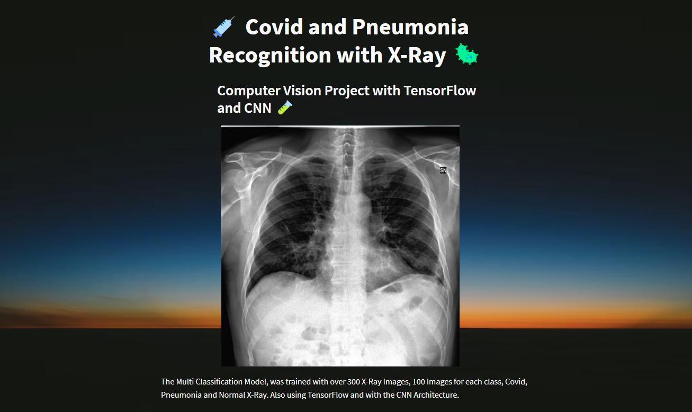
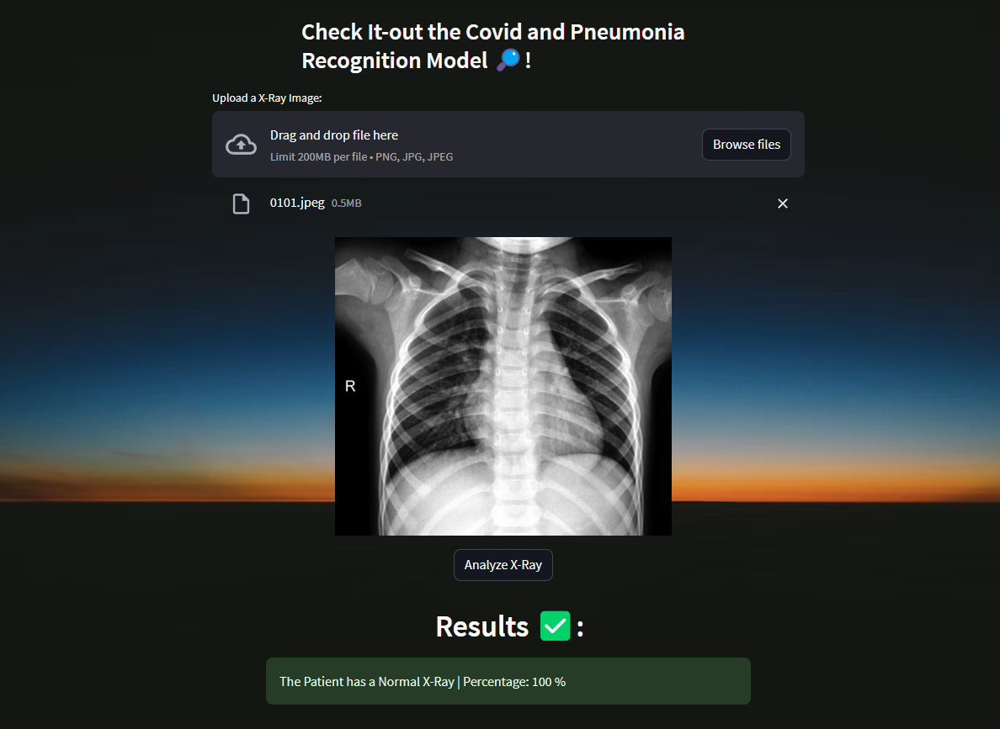

# Covid-19 and Pneumonia Recognition with X-Ray, Streamlit, CNN and TensorFlow 🦠



## Multi - Classification Model with TensorFlow and Convolutional Neural Network

The Model, was trained with over 300 X-Ray Images, 100 Images for each class, Covid, Pneumonia and Normal X-Ray. Also using TensorFlow and with the CNN Architecture.

## Check-it out
Test it by running the `app.py` file, built with `Streamlit`.

## Run
```sh
streamlit run app.py
```



## Resources
Code Explained at: https://mendezluisjose.hashnode.dev/covid-19-and-pneumonia-model

X-Ray Dataset: https://www.kaggle.com/datasets/pranavraikokte/covid19-image-dataset


